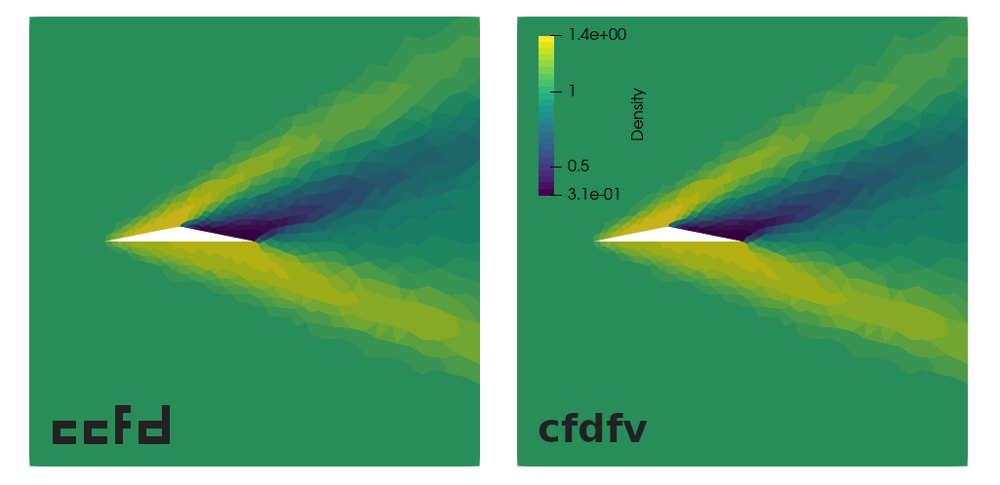

This code is intended to become a drop-in replacement for `cfdfv`, a CFD code written in Fortran by the [Institute of Aerodynamics and Gas Dynamics](https://www.iag.uni-stuttgart.de/en/) at the University of Stuttgart for a CFD programming course. This code itself is not available online, as far as I know, but it features a similar code structure to [FLEXI](https://www.flexi-project.org/).

The program uses [CGNS](https://cgns.github.io/), for storing the calculation results.

The logo is heavily inspired by the software over at [suckless.org](https://suckless.org/).



# Dependencies

- `git`
- `gcc`
- `make`
- `cmake`
- `gnuplot` (optional, for displaying calculation residuals, available [here](http://www.gnuplot.info/))
- `gmsh` (optional, for mesh generation, available [here](http://gmsh.info/))
- `paraview` (optional, for post-processing the results, available [here](https://www.paraview.org/))

# Installation

The installation process is easiest on Linux, but possible on MacOS and Windows.

## Linux

First make sure that all necessary dependencies are all installed. These can usually be obtained through your distributions package manager, on Arch based systems the following command should suffice
```
# pacman -S git base-devel cmake
```
For an Ubuntu based system the following command should be enough
```
# apt-get install git build-essential cmake libomp-dev
```

Next, navigate to the directory where you want to keep `ccfd`, clone the git repository and compile the code
```
$ cd path/to/directory
$ git clone https://github.com/hhh95/ccfd.git
$ cd ccfd
$ make
```
There should now be two new folders, `obj` and `bin`, the last one containing the `ccfd` executable.

Continue with [Usage](#usage).

## MacOS

I only had access to MacOS High Sierra, so some things might have changed, but the general procedure should still be the same on any MacOS version. First, install a package manager that can install all the necessary software for you. I suggest [Homebrew](https://brew.sh/). Head on over to their website and follow the installation instructions. Once you're done, install the necessary software to compile `ccfd`
```
$ brew update
$ brew upgrade
$ brew install git gcc make cmake libomp
```
Due to the fact, that on MacOS `gcc` is linked to `clang` per default, which does not work well with OpenMP, you will have to make a minor edit to the `Makefile`. Open the file with your favorite editor and find the line that defines the C compiler to be used
```
CC     = gcc
```
Replace `gcc` with the version that you have installed, most likely it is `gcc-9`. To find out which version you have, do the following
```
$ ls /usr/local/bin/gcc*
```

Next, navigate to the directory where you want to keep `ccfd`, clone the git repository and compile the code
```
$ cd path/to/directory
$ git clone https://github.com/hhh95/ccfd.git
$ cd ccfd
$ make
```
There should now be two new folders, `obj` and `bin`, the last one containing the `ccfd` executable.

Continue with [Usage](#usage). When installing ParaView, do not choose the Linux version, but the MacOS version.

When using `ccfd` it is very handy to have the ability to open a terminal in a folder from Finder. This is possible, but has to be activated first. Go to *System-settings*->*Keyboard*->*Services* and then check the box in front of the option *New Terminal at Folder*. Now, you can right click a folder in Finder and open a terminal in that folder.

## Windows

I am still working on installing it on Windows directly, but have not yet managed to do so. For now it only works with a [Linux Bash shell](https://docs.microsoft.com/en-us/windows/wsl/install-win10). Get the latest Ubuntu shell and complete the installation process. Next, start the Ubuntu shell and install the necessary utilities (if you have never used Linux before, `$` in front of a command means the command can be executed as a normal user and `#` in front of a command means, you need administrative rights; these can be obtained by typing `sudo` in front of the command and entering the password)
```
# apt update
# apt upgrade
# apt install git build-essential cmake libomp-dev
```

Now change to your desired working directory
```
$ git clone https://github.com/hhh95/ccfd.git
$ cd ccfd
$ make
```
There should now be two new folders, `obj` and `bin`, the last one containing the `ccfd` executable.

After everything is set up, continue with [Usage](#usage). However, when installing ParaView, do not install it in the Ubuntu shell, but rather install it normally for [Windows](https://www.paraview.org/download/). When you want to access the files created by `ccfd` from Windows, just type the following into the Ubuntu shell
```
$ explorer.exe .
```
This will open the directory in the Windows explorer and you can easily access the file with ParaView.

If, after trying to open ParaView, you get an error that a 'VCOMP140.DLL' library is missing, follow the explainatins of this [Forum Post](https://answers.microsoft.com/en-us/windows/forum/windows_10-performance/missing-vcomp140dll/afca0b6b-3ced-4e82-8ce8-8734a440d516).

# Usage

As a first step you should add the `ccfd` executable to your path. You can do so by running
```
$ source ccfdrc
```
Next, navigate to the `calc` folder. Here you will find example case files, contained in folder. First, try the Riemann problems. Navigate to the `riemann` folder with
```
$ cd riemann
```
Here you will find the SOD test case, as well as different versions of the case. Start a calculation with
```
$ ccfd sod.ini
```
and observe the output. There should be four new files. The initial condition of the case and the calculation results at t = 0.25 s. They should all be `.csv` files. You can examine them with any spreadsheet program you like. Alternatively you can use ParaView, a free post-processing program, that can visualize 1D, 2D, and 3D data. For Arch-based distributions you can install it from the package manager
```
# pacman -S paraview
```

On Ubuntu, the ParaView program in the repositories does not read CGNS files correctly for some reason. You will need to download ParaView 5.8 from the [ParaView website](https://www.paraview.org/download/). Next do the following
```
$ cd folder/where/you/downloaded/paraview
$ tar -xvf ParaView-5.8.0-MPI-Linux-Python3.7-64bit.tar.gz
# mv ParaView-5.8.0-MPI-Linux-Python3.7-64bit.tar.gz /opt
$ echo "export PATH:$PATH:/opt/ParaView-5.8.0-MPI-Linux-Python3.7-64bit/bin" >> ~/.bashrc
```
Next open ParaView in the directory where you performed the calculations
```
$ cd path/to/ccfd/calc/riemann
$ paraview &
```
Now, click on *File*->*Open* and select both sets of `.csv` files. Because the results are 1D data, you need to change from *Render View* to *Line Chart View*. In the top right of the viewing area, click on the `X` button. Now select *Line Chart View* from the list. You should now see an empty grid with an x-, and a y-axis. In the *Pipeline Browser* to the left, click on the eye icons in front of the loaded files. A plot should appear on the axis grid. It will probably show the initial state. In the top bar, click on the play button. Now, the final state should be shown. You will see the analytical, or exact, solution, as well as the numerical solution.

For more information on the theory, maybe have a look at [Wikipedia](https://en.wikipedia.org/wiki/Sod_shock_tube).

The procedure for running the other cases is the same. However, if the solution data is 2D, then you do not need to switch to *Line Chart View*. The 2D CGNS output files will usually have more than just the solution file. You can load everything at once by selecting the file that has `_Master` in its name. After loading the file, select all *Cell Arrays* in the *Pipeline Browser* and click on *Apply*. Then you can look at the different fields of the solution, by selecting them in the top bar (where it first says *Solid Color*).

Some files can only be run with the Navier-Stokes equations. In order the switch between Euler and Navier-Stokes equations, open the `Makefile` and change the `EQNSYS` parameter.
